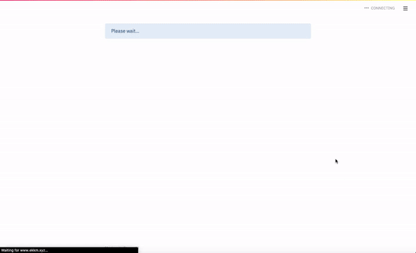

# Face Generation from Textual Description - Streamlit App

Check the main repository [here](https://github.com/kad99kev/Face-Generator).

## Demo



## How to set it up locally
 ### Using Docker
  **1. Clone the Repository**
  ```
  git clone https://github.com/kad99kev/FGTD-Streamlit
  ```

  **2. Change Working Directory**
  ```
  cd FGTD-Streamlit
  ```

  **3. Setup Docker**
  ```
  docker image build -t streamlit:app .
  docker container run -p 8501:8501 -d streamlit:app
  ```
 
  **4. Open the URL**
 
  Enter the URL specified in the console. It will be something similar to http://localhost:8501. You will be able to access the app here.
 
 ***
 
 ### Using a Virtual Environment (Like Anaconda)
 
  **1. Clone the Repository**
  ```
  git clone https://github.com/kad99kev/FGTD-Streamlit
  ```
 
  **2. Change Working Directory**
  ```
  cd FGTD-Streamlit
  ```
 
  **3. Create and Activate a Virtual Environment**
  ```
  conda create --name <name> python=3.7
  conda activate <name>
  ```

  **4. Download the Requirements**
  ```
  pip install requirements.txt
  ```
 
  **5. Run Streamlit**
  ```
  streamlit run app.py
  ```
 
  **6. Open the URL**
 
  Streamlit will automatically open the browser for you. You can also open one of the links mentioned in the console.
 

## References
- [Streamlit documentation](https://docs.streamlit.io/en/stable/).
- [Streamlit 101: An in-depth introduction](https://towardsdatascience.com/streamlit-101-an-in-depth-introduction-fc8aad9492f2).
- [A curated list of awesome streamlit resources](https://github.com/MarcSkovMadsen/awesome-streamlit).
